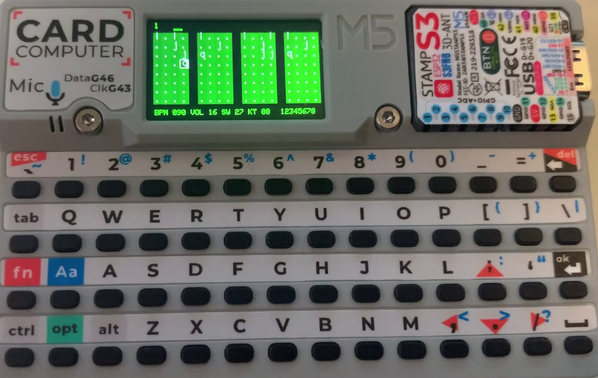

# Cardputer drums

This is a simple and lofi drum machine for the [M5Cardputer](https://shop.m5stack.com/products/m5stack-cardputer-kit-w-m5stamps3?srsltid=AfmBOoqHMPXzj-fobFJN0uUYR1yChvbehNYaBXx4sJz9z3Eqjelnhx3n). 

<iframe width="1280" height="720" src="https://www.youtube.com/embed/r_0vd7Hbe3E" title="M5Cardputer drum machine" frameborder="0" allow="accelerometer; autoplay; clipboard-write; encrypted-media; gyroscope; picture-in-picture; web-share" referrerpolicy="strict-origin-when-cross-origin" allowfullscreen></iframe>

## Features

* 16KHz sample rate
* 16 steps, 8 tracks
* 20 patterns
* Swing/shuffle
* Channel mute/solos
* Per-step velocity and sub-tick timing adjustment
* Pattern sequencer
* Multiple drum kits

## UI
The dot grid indicates the 16x8 steps for the current pattern. 

### Status line

#### Top
* [0] Pattern number
* If there's a pattern sequence, the patterns appear next to the pattern number (e.g. `12241223`)

### Bottom
* **BPM** current BPM (60-320)
* **SWI** current swing (0-99; about 20-30 is useful)
* **VOL** volume (0-16)
* **KIT** kit selected 
* **12345678** channel enabled status. Mute'd channels are grayed. Solo'd channels are red. 

## Controls

* Letter keys `a-z` enter sounds. See the drum map for details.
* `0-9` sets the velocity of the current step (0=silent, 9=max. 6=default)
* `del` deletes the current step
* `[` "kick left" shift step timing back by 1/12 step
* `]` "kick right" shift step timing forward by 1/12 step

* `fn+↑` increase BPM
* `fn+↓` decrease BPM

* `fn+←` decrease swing
* `fn+→` increase swing

* `fn+[` decrease volume
* `fn+]` increase volume

* `Button A` enter instant preview mode -- press a key to hear the sample preview. `Button A` switches back to pattern mode.

### Sequencer

* `opt+<n>` where `n` is 0-9 selects pattern `n`
* `opt+ESC` toggle pattern sequence mode
* `opt+←` pattern cursor left
* `opt+→` pattern cursor right
* `opt+ENTER` insert current pattern at cursor
* `opt+DEL` delete pattern at cursor

### channel
* `fn+<n>` mute channel `n`
* `fn+shift+<n>` solo channel `n`

### Kits
* `alt+<n>` select drum kit `n` (note: this will cause a delay as the kit is synthesised)

### clipboard
* `fn+d` delete current pattern
* `fn+c` copy current pattern to clipboard
* `fn+c` cut current pattern to clipboard
* `fn+v` paste current pattern to clipboard
* NOTE: all clipboard functions operate only on currently enabled channels. So e.g. solo'ing one channel allows you to selectively delete/copy it (or muting all but three channels, etc.)

## Drumkit

* `a` -> `h` bass, major scale
* `i` kick
* `j` closed hat
* `k` snare 
* `l` click/rimshot
* `m` tom
* `n` sweep
* `o` beep
* `p` open hat
* `q` clap
* `r` low bass
* `s` cowbell
* `t` damped bell
* `u` crash
