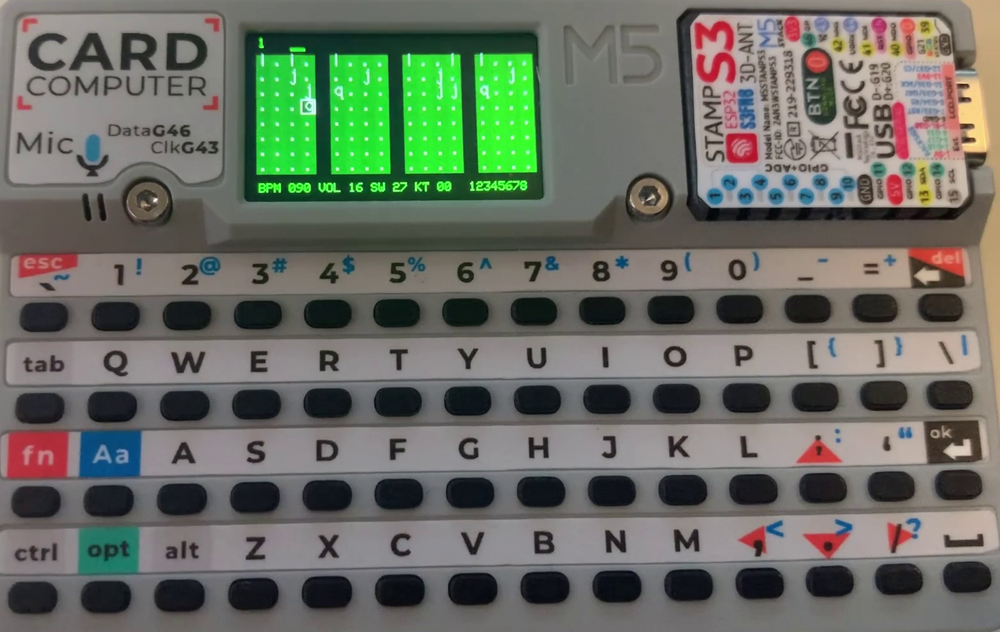

# Bonnethead: Cardputer drums

[**DEMO VIDEO**](https://www.youtube.com/watch?v=r_0vd7Hbe3E)

This is a simple and lofi drum machine for the [M5Cardputer](https://shop.m5stack.com/products/m5stack-cardputer-kit-w-m5stamps3?srsltid=AfmBOoqHMPXzj-fobFJN0uUYR1yChvbehNYaBXx4sJz9z3Eqjelnhx3n). 

**Now available on M5Burner as "Bonnethead"** 

## Features

* 16KHz sample rate
* 16 steps, 8 tracks
* 20 patterns
* Swing/shuffle
* Channel mute/solos
* Per-step velocity and sub-tick timing adjustment
* Pattern sequencer
* Per-channel filters
* Multiple drum kits
* Live keydrumming mode
* Render to SD card
* Sampled drum kits
* Tap tempo

## UI
The dot grid indicates the 16x8 steps for the current pattern. 

### Status line

#### Top
* [0] Pattern number
* If there's a pattern sequence, the patterns appear next to the pattern number at the top line (e.g. `12241223`)

### Bottom
* **BPM** current BPM (60-320)
* **SW** current swing (0-99; about 20-30 is useful)
* **VOL** volume (0-16)
* **KT** kit selected 
* **12345678** channel enabled status. Mute'd channels are grayed. Solo'd channels are red. 

## Controls

### Pattern
* `a-z` enter sounds. See the drum map for details.
* `0-9` sets the velocity of the current step (0=silent, 9=max. 6=default)
* `del` deletes the current step
* `[` "kick left" shift step timing back by 1/12 step
* `]` "kick right" shift step timing forward by 1/12 step

* ` ` (space) tap tempo. Press four times to set the tempo.

* `fn+↑` increase BPM
* `fn+↓` decrease BPM

* `fn+←` decrease swing
* `fn+→` increase swing

* `fn+[` decrease volume
* `fn+]` increase volume

* `Button A` enter instant preview mode -- press a key to hear the sample preview. `Button A` switches back to pattern mode.

### Files

* `fn+s` Save the current pattern in the working buffer (automatically reloaded on startup) 
* `fn+a <x>` Save the file as bank <x> (0-9a-z)
* `fn+o <x>` Open a file; where <x> is the bank (0-9a-z)
* `fn+n` New file, reset everything 
* `fn+r` Render the current pattern to a WAV file on the SD card. The file will be named `/bonnethead/renders/render-<n>.wav`

### Sequencer

* `opt+<x>` where `n` is 0-9 selects pattern `n`
* `opt+shift+<x>` fill pattern `n` after this pattern, then resume 
* `opt+ESC` toggle pattern sequence mode
* `opt+←` pattern cursor left
* `opt+→` pattern cursor right
* `opt+ENTER` insert current pattern at cursor
* `opt+DEL` delete pattern at cursor

### channel
* `fn+k` enter keydrumming mode. Press keys to play the drum sounds. Press `fn+k` to exit keydrumming mode. (note: red circle at bottom indicates live keydrumming mode). Shift-K enables step-quantized keydrumming mode.
* `fn+<n>` toggle mute channel `n`
* `fn+shift+<n>` toggle solo channel `n` (multiple channels can be solo'd)
* `fn+enter` toggle solo the current channel (where the cursor is)
* `fn+-` decrease filter cutoff on active channels (16 steps of filter)
* `fn+=` increase filter cutoff on active channels
* `fn+\` decrease channel volume on active channels
* `fn+'` inccrease channel volume on active channels
* `fn+shift+←` rotate pattern left
* `fn+shift+→` rotate pattern right

### Kits
* `alt+<x>` select drum kit `x` (note: this will cause a delay as the kit is synthesised/loaded)
    * Only kits 1-4 are available w/o an SD card.

### clipboard
* `fn+d` delete current pattern
* `fn+c` copy current pattern to clipboard
* `fn+x` cut current pattern to clipboard
* `fn+v` paste current pattern to clipboard
* NOTE: all clipboard functions operate only on currently enabled channels. So e.g. solo'ing one channel allows you to selectively delete/copy it (or muting all but three channels, etc.)

## Drumkit

* `a` -> `h` bass, major scale
* `i` kick
* `j` closed hat
* `k` snare 
* `l` click/rimshot
* `m` tom
* `n` sweep
* `o` beep
* `p` open hat
* `q` clap
* `r` low bass
* `s` cowbell
* `t` damped bell
* `u` crash

## Preview mode

* `fn+s` <n> save kit
* `fn+o` <n> load kit
* `fn+n` reset kit
* `opt` hold for fine adjust
* `alt` hold for coarse adjust
* `alt+opt` hold for very coarse adjust
* `↑` increase value
* `↓` decrease value
* ` ` reset parameter
* `←` previous parameter
* `→` next parameter 

